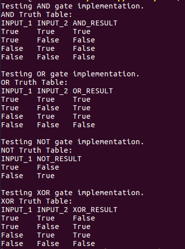

# Homework 2 Results
### Aakash Pydi
---

The forward propagation neural network is implemented in neural_network.py. The functionality of the classes defined in logic_gates.py relies on this neural network. The class representations of the AND, OR, NOT, and XOR gates is given in logic_gates.py. 

The implemented classes were tested in test.py. The output of executing test.py is given below.

